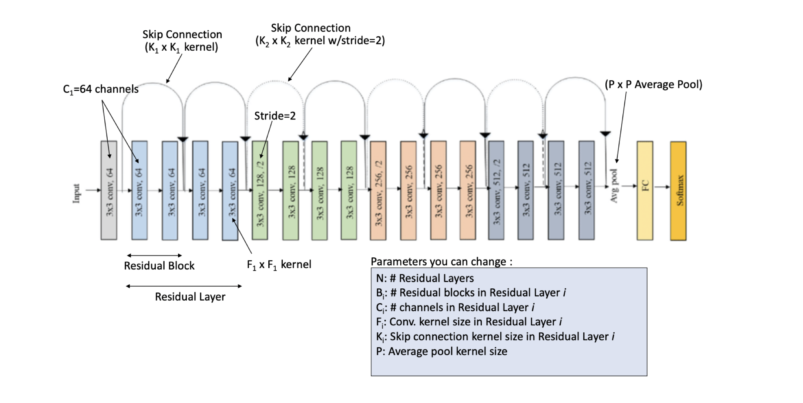

# Mini-Project-DL

Original model's parameters list:

We tried the following sets of hyperparameters for 100 epochs each.

| Hyperparameters    |                     |               | Validation accuracy  |
| :---               |      :----:         |   :----:      |        ---:          |
|   Cin   |  Cout/ F |               |                      | 
|                    |                     |               |                      |
